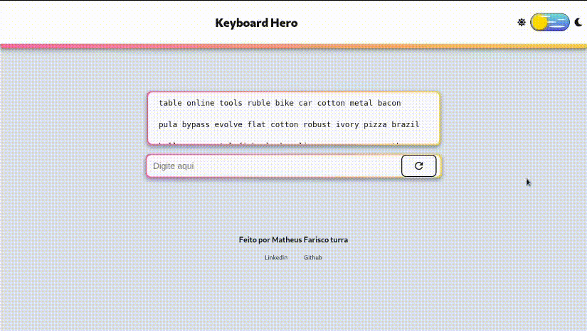

<div align="center">
    <h1>
        <strong>Keyboard Hero</strong>
    </h1>
    <sub>:construction: Em desenvolvimento :construction:</sub>
</div>

<br/>
<br/>


<h6 align="center"> Estado atual do projeto 
</br>
</br>

## Sobre o projeto 📝
O projeto **keyboard Hero** tem o intuito de testar a sua habilidade de digitação em uma certa quantidade de tempo. O teste consiste na exibição de palavras inglesas aleatórias e 1 minuto para conclui-lo, o resultado é exibido em tempo real mostrando sua precisão de digitação e a quantidade de palavras por minuto (WPM em inglês), após 1 minuto de jogo se encerra o teste se encerra.

</br>

## Funcionalidades ⚙️

* Prontas ⚡
  * Seleção de tema escuro ou claro.
  * Persistência do tema via Cookies.   
  * Exibir texto aleatório.
  * Avaliação de texto em tempo real.
  * Cronômetro.
  * Botão para reiniciar jogo.

<br>

* Em desenvolvimento 👷‍♂️
  * Diferentes testes.
  * Interface de escolha de idioma e texto.
  * Interface de introdução ao projeto.{:target="_blank"}

<br>

## Tecnologias Utilizadas :rocket:	
* [Next JS](https://nextjs.org/)
* [Styled Components](https://styled-components.com/)
* [Nookies](https://github.com/maticzav/nookies)
* [Faker](https://github.com/faker-js/faker)

<br>


## Como testar o projeto :electric_plug:

* #### acesse o link: https://keyboard-hero.vercel.app/

<br>

## Instalação local

#### Pré requisitos
* [Node JS > v12](https://nodejs.org/en/)
* [Npm](https://www.npmjs.com/)
* [Git](https://git-scm.com/downloads)

<br>

```bash
  # Clonar o repositório
  git clone https://github.com/MatheusTurra/KeyboardHero.git

  # Entrar no diretório
  cd KeyboardHero

  # Instalar dependências
  npm install

  # Executar a aplicação
  npm run dev
  
  # Acesse http://localhost:3000/ no em seu navegador
```
<hr/>
<h4 align="center">Desenvolvido por :hurtrealbad: Matheus Farisco Turra</h4>
